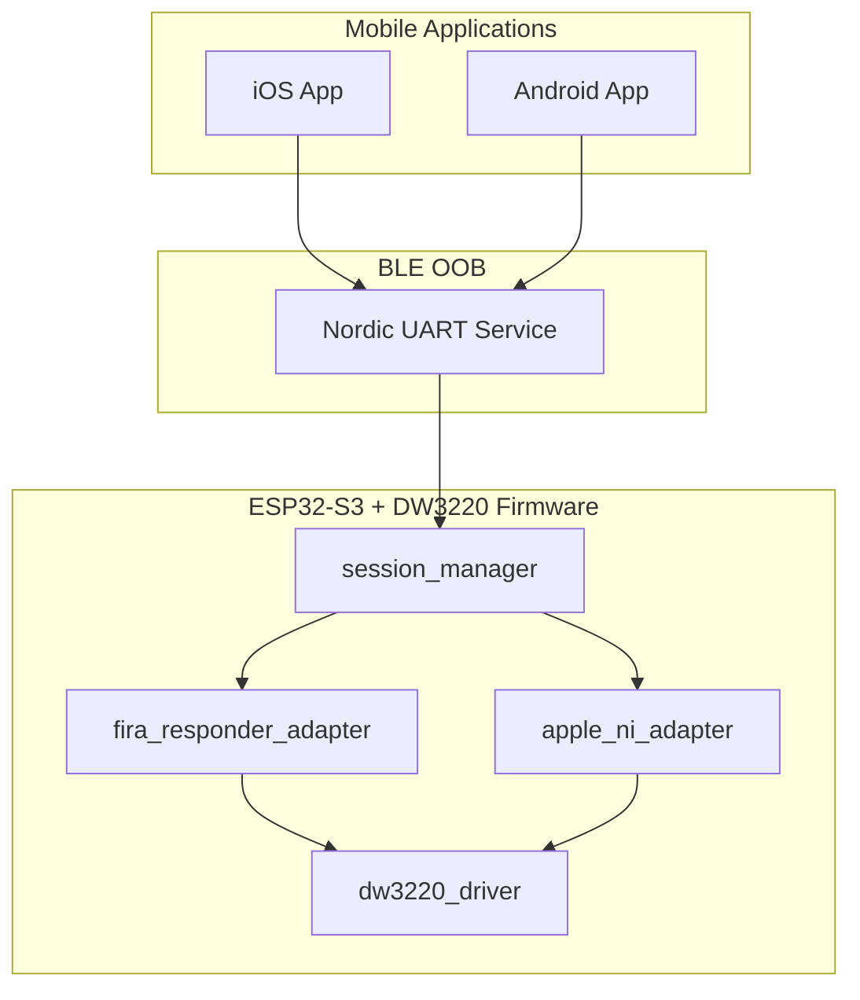
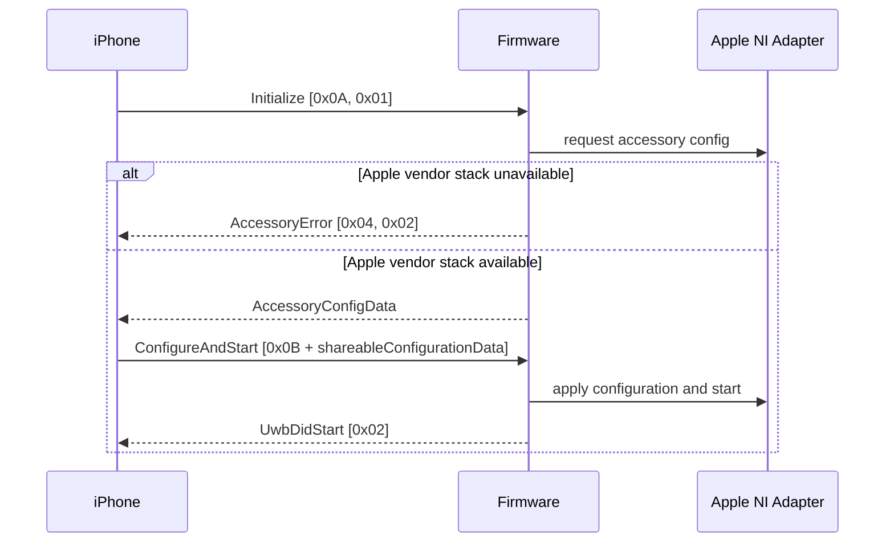
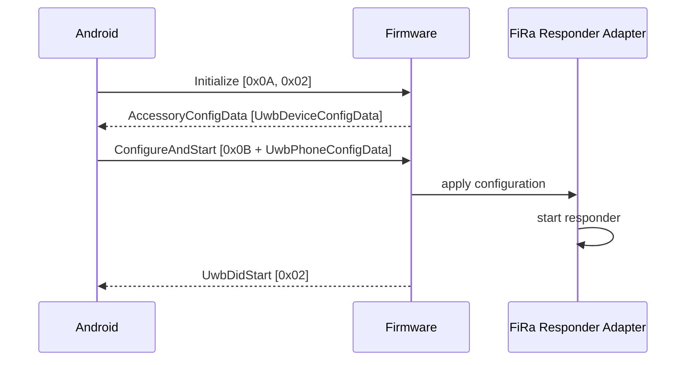

# DIY UWB Module — Compatible with Apple and Android


ENGLISH | [简体中文](README_CN.md)

> [!TIP]
> Due to proprietary protocol restrictions imposed by Apple on the iPhone, this project currently does not support cross-platform connectivity.
> On the iPhone side, you can utilize [Qorvo Nearby Interaction](https://apps.apple.com/tr/app/qorvo-nearby-interaction/id1615369084) to connect with DIY UWB modules. (Tested hardware: Qorvo DW3220 + Nordic nRF52832)

This repository implements and organizes a cross-platform access solution for a custom UWB accessory based on `ESP32-S3 + DW3220`, targeting both `iPhone Nearby Interaction` and `Android Jetpack UWB`.

The project scope focuses on the following objectives:

- Enable the same hardware platform to establish UWB accessory sessions with both iOS and Android
- Unify the BLE OOB protocol, application-side session entry points, and firmware-side state boundaries
- Provide a unified three-dimensional ranging data output on the phone side
- Provide a maintainable foundation for future firmware completion, protocol extension, and application-side integration

In this repository, “cross-platform” means compatibility with both iOS and Android on the same hardware platform. It does not include dual-phone concurrent session support.

## Related Demos

[iPhone Integration Demo Video](demo/iPhone_demo_video.mp4)

[Android Integration Demo Image](demo/Android_demo_pic.png)

[DIY UWB Module Example Image (Using Nordic nRF52832)](demo/DIY_UWB_module_pic.png)

## Project Baseline

This repository is built on top of the following two upstream projects:

- Android baseline:
  [NXP UWBJetpackExample](https://github.com/nxp-uwb/UWBJetpackExample)
- iOS baseline:
  Nearby Interaction accessory sample code provided in `Qorvo_Apple_Nearby_Interaction_v1.3/`

On top of these baselines, this repository adds a unified protocol, a firmware project skeleton, application-side modifications, and repository-level technical documentation.

## Work Scope

The following items have already been completed and are included in version control.

### 1. BLE OOB protocol unification

The BLE OOB initialization stage has been changed from implicit platform branching to explicit platform declaration:

```text
Initialize = [0x0A, platformId]
```

Where:

- `0x01` indicates iOS
- `0x02` indicates Android

A unified explicit error response has also been added:

```text
AccessoryError = [0x04, errorCode]
```

This adjustment is intended to clearly distinguish unsupported platform, invalid configuration, session busy state, and missing Apple vendor stack conditions, reducing ambiguity during BLE OOB session establishment.

### 2. Unified application-side ranging data model

The Android side now provides the following unified ranging outputs:

- `distance`
- `azimuth`
- `elevation`
- `x / y / z`

The iOS side has also been updated to organize and output ranging results with the same objective, making cross-platform comparison, log analysis, and integration testing easier.

### 3. Firmware platform adapter boundary split

The firmware is now explicitly split into the following two platform adapter entry points:

- `apple_ni_adapter`
- `fira_responder_adapter`

The purpose of this separation is to isolate platform-specific capabilities behind explicit interfaces, instead of continuing to couple them with the session state machine and BLE OOB logic.

### 4. Repository-level documentation and maintenance structure

The repository root documentation, protocol description, development guide, and hardware guide have been organized to support the following scenarios:

- Public repository presentation
- Handover to future maintainers
- Protocol field and flow verification
- Firmware and mobile application integration work

## Current Capability Boundary

### Android path

On the Android side, the following work has been completed:

- Integration of the new BLE OOB protocol
- Explicit error handling
- Three-dimensional ranging result display
- Build chain correction and local `assembleDebug` verification

The current limitation is that the firmware-side `DW3220 responder` is still not a complete production-grade implementation.  
At this stage, the more accurate description is that the Android path already has a complete upper-layer integration framework, while the lower-layer responder capability still requires further work.

### iPhone path

On the iOS side, the following work has been completed:

- Integration of the new BLE OOB protocol
- Firmware error propagation
- Per-device storage of `NINearbyAccessoryConfiguration`
- Three-dimensional ranging result organization

At the current stage, this repository should not be described as “sufficient to achieve complete Nearby Interaction accessory ranging between custom hardware and iPhone using only open-source code.”  
The limitation is not at the application layer. The missing part is the Apple/Qorvo private accessory-side implementation. To avoid ambiguity, the current firmware explicitly returns `apple_stack_missing`.

## Repository Layout

```text
.
|-- README.md
|-- README_EN.md
|-- LICENSE
|-- THIRD_PARTY_NOTICES.md
|-- docs/
|   |-- ble-oob-protocol.md
|   |-- development-guide/
|   `-- hardware-guide/
|-- firmware/
|   `-- esp32-dw3220/
|-- NXP_Android_UWBJetpackExample-main/
`-- Qorvo_Apple_Nearby_Interaction_v1.3/
```

The main directories are organized as follows:

| Path | Description |
|---|---|
| `NXP_Android_UWBJetpackExample-main/` | Android application project |
| `Qorvo_Apple_Nearby_Interaction_v1.3/` | iOS application project |
| `firmware/esp32-dw3220/` | Firmware project for `ESP32-S3 + DW3220` |
| `docs/` | Protocol, development, and hardware documentation |
| `README.original.md` | Archived historical Chinese README |

## Default Hardware Baseline

The current default hardware baseline is:

- MCU: `ESP32-S3`
- UWB: `Qorvo DW3220`
- BLE OOB: `Nordic UART Service (NUS)`

`ESP32-S3` is selected primarily based on BLE capability, engineering convenience, and compatibility with the current firmware framework. The protocol design itself is not inherently tied to this MCU.

## System Architecture



## Platform Flows

### iPhone



### Android



## Protocol Summary

See the full definition in [ble-oob-protocol.md](C:/Users/hrx/Desktop/UWB/docs/ble-oob-protocol.md).

Core messages are listed below:

| Direction | ID | Meaning |
|---|---|---|
| Accessory -> Phone | `0x01` | Return platform-specific configuration |
| Accessory -> Phone | `0x02` | UWB started |
| Accessory -> Phone | `0x03` | UWB stopped |
| Accessory -> Phone | `0x04` | Return error |
| Phone -> Accessory | `0x0A` | Initialize |
| Phone -> Accessory | `0x0B` | Configure and start |
| Phone -> Accessory | `0x0C` | Stop |

The currently defined error codes are:

| errorCode | Meaning |
|---|---|
| `0x01` | `unsupported_platform` |
| `0x02` | `apple_stack_missing` |
| `0x03` | `invalid_config` |
| `0x04` | `busy` |

## 3D Ranging Result Representation

This repository keeps two representations for ranging results:

- Spherical coordinates: `distance / azimuth / elevation`
- Cartesian coordinates: `x / y / z`

The Android side currently uses the following conversion:

```text
x = distance * cos(elevation) * sin(azimuth)
y = distance * sin(elevation)
z = distance * cos(elevation) * cos(azimuth)
```

The iPhone side directly uses `NINearbyObject.direction`:

```text
x = direction.x * distance
y = direction.y * distance
z = direction.z * distance
```

## Build and Verification

### Android

The following combination has been verified to compile:

- Gradle Wrapper: `8.13`
- AndroidX UWB: `1.0.0-beta01`
- `compileSdk 36`

Build command:

```powershell
$env:ANDROID_HOME="C:\Users\<your-user>\AppData\Local\Android\Sdk"
$env:ANDROID_SDK_ROOT=$env:ANDROID_HOME
cd .\NXP_Android_UWBJetpackExample-main\source
.\gradlew.bat assembleDebug
```

### iPhone

Build environment requirements:

- macOS
- Xcode
- iPhone device with Nearby Interaction support

Open the project with:

```bash
open Qorvo_Apple_Nearby_Interaction_v1.3/NINearbyAccessorySample.xcodeproj
```

### Firmware

Build environment requirements:

- ESP-IDF
- `ESP32-S3`
- `DW3220` hardware wiring completed

Project directory:

```powershell
cd .\firmware\esp32-dw3220
```

`idf.py` is not installed on the current host, so firmware build verification has not been completed in this environment.

## Key Code Entry Points

If you need to maintain or extend this repository, the following files are recommended starting points:

- [QorvoDemoViewController.swift](C:/Users/hrx/Desktop/UWB/Qorvo_Apple_Nearby_Interaction_v1.3/NINearbyAccessorySample/QorvoDemoViewController.swift)
- [MainActivity.java](C:/Users/hrx/Desktop/UWB/NXP_Android_UWBJetpackExample-main/source/app/src/main/java/com/jetpackexample/MainActivity.java)
- [RangingSample.java](C:/Users/hrx/Desktop/UWB/NXP_Android_UWBJetpackExample-main/source/app/src/main/java/com/jetpackexample/RangingSample.java)
- [oob_protocol.h](C:/Users/hrx/Desktop/UWB/firmware/esp32-dw3220/main/ble_oob/oob_protocol.h)
- [session_manager.c](C:/Users/hrx/Desktop/UWB/firmware/esp32-dw3220/main/session/session_manager.c)
- [apple_ni_adapter.c](C:/Users/hrx/Desktop/UWB/firmware/esp32-dw3220/main/platform/apple_ni_adapter.c)
- [fira_responder_adapter.c](C:/Users/hrx/Desktop/UWB/firmware/esp32-dw3220/main/platform/fira_responder_adapter.c)

## Known Limitations and Follow-Up Work

### iPhone path

The following capabilities are still missing:

- Real generation of Apple Nearby Interaction accessory configuration bytes
- Accessory-side implementation capable of interpreting `shareableConfigurationData`
- Apple/Qorvo private protocol resources or vendor-side implementation

### Android path

The following items still need further completion:

- A more complete `DW3220` responder low-level implementation
- FiRa responder state machine details
- Antenna delay calibration
- Board-level integration and air-interface validation

## Documentation Index

- [BLE OOB Protocol](C:/Users/hrx/Desktop/UWB/docs/ble-oob-protocol.md)
- [DW3220 Development Guide](C:/Users/hrx/Desktop/UWB/docs/development-guide/DW3220-Development-Guide.md)
- [DW3220 Hardware Guide](C:/Users/hrx/Desktop/UWB/docs/hardware-guide/DW3220-Hardware-Guide.md)
- [Firmware README](C:/Users/hrx/Desktop/UWB/firmware/esp32-dw3220/README.md)
- [Original README](C:/Users/hrx/Desktop/UWB/README.original.md)

## License and Third-Party Code

This repository is not a single-license repository.

Repository-level integration code, glue code, documentation, and supplemental files are handled under `Apache License 2.0`; the two upstream directories continue to follow their original licensing terms:

- `NXP_Android_UWBJetpackExample-main/`
  continues under Apache License 2.0
- `Qorvo_Apple_Nearby_Interaction_v1.3/`
  continues under the Qorvo source file headers and accompanying licensing materials

See the detailed notes here:

- [LICENSE](C:/Users/hrx/Desktop/UWB/LICENSE)
- [THIRD_PARTY_NOTICES.md](C:/Users/hrx/Desktop/UWB/THIRD_PARTY_NOTICES.md)

For the Qorvo code, the current repository materials support the following understanding:

- The source file headers permit modification and redistribution as long as the original copyright, conditions, and disclaimer are retained
- Usage is restricted to Qorvo ICs or modules containing Qorvo ICs
- The repository should not be presented as a uniformly Apache-licensed project
- Qorvo binaries, prebuilt libraries, or object-code-only software with unclear redistribution rights should not be uploaded together with the repository

If this repository is intended for formal commercial release, a dedicated license compliance review is recommended before publication.
