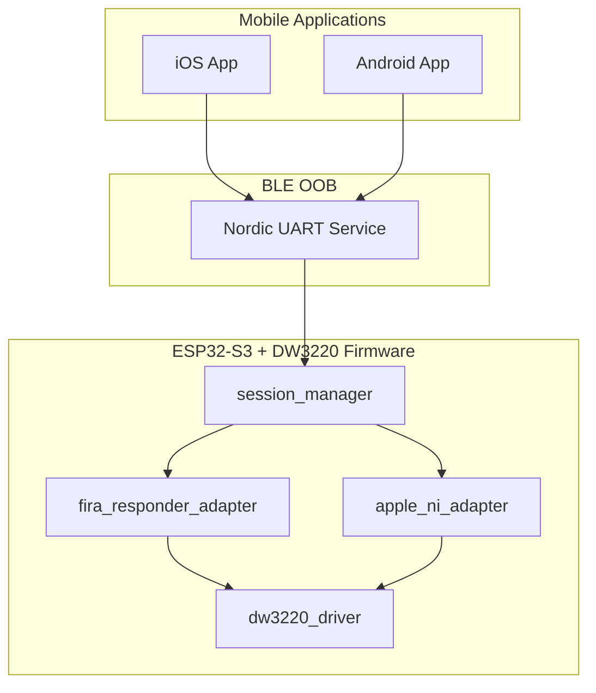
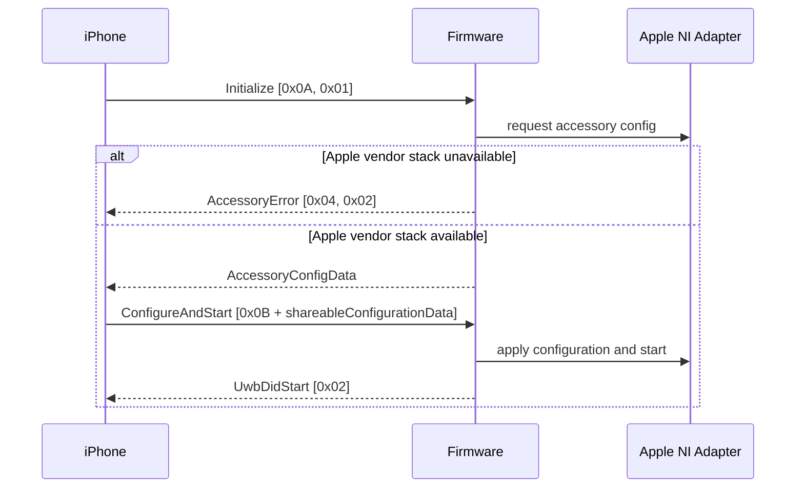
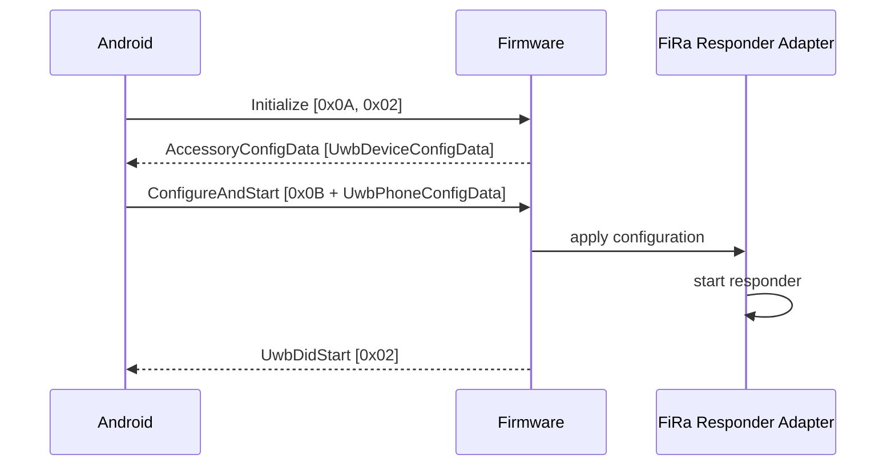

# DIY UWB模组 - 适配Apple和Android平台


[ENGLISH](README.md) | 简体中文

> [!TIP]
> 本项目受限于Apple在iPhone的私有协议限制，目前暂未打通跨平台连通。
> iPhone端可利用[Qorvo Nearby Interaction](https://apps.apple.com/tr/app/qorvo-nearby-interaction/id1615369084)连接DIY的UWB模组。（测试硬件：Qorvo DW3220 + Nordic nRF52832）

本仓库整理并期望实现一套基于`Qorvo DW3220`的自制 UWB 模组的跨平台接入方案，用于对接 `iPhone Nearby Interaction` 与 `Android Jetpack UWB`。

项目聚焦于以下目标：

- 同一套硬件完成 iOS 与 Android 手机的UWB连接
- 统一 BLE OOB 协议、应用侧会话入口与固件侧状态边界
- 在手机侧统一输出三维测距结果
- 为后续固件完善、协议扩展与应用侧联调提供清晰的维护基础

本仓库中的“跨平台”指同一套硬件兼容 iOS 与 Android 两端，不包含双手机并发会话能力。

## 相关演示

[iPhone端接入演示视频](demo/iPhone_demo_video.mp4)

[Android端接入演示图片](demo/Android_demo_pic.png)

[DIY UWB模组实例图片（此处采用Nordic nRF52832）](demo/DIY_UWB_module_pic.png)

## 项目说明

本仓库基于以下两套工程进行开发：

- Android：
  [NXP UWBJetpackExample](https://github.com/nxp-uwb/UWBJetpackExample)
- iOS：
  `Qorvo_Apple_Nearby_Interaction_v1.3/` 中的 Nearby Interaction 配件样例代码
  （由Qorvo与Apple提供，详见LICENSE）

在此基础上，本仓库补充了统一协议、固件工程骨架、应用侧改造以及技术文档。

## 改动内容

### 1. BLE OOB 协议统一

BLE OOB 初始化阶段已由隐式平台分流调整为显式平台声明：

```text
Initialize = [0x0A, platformId]
```

其中：

- `0x01` 表示 iOS
- `0x02` 表示 Android

同时增加了统一错误返回：

```text
AccessoryError = [0x04, errorCode]
```

该调整用于明确区分平台不支持、配置无效、会话占用以及 Apple 私有栈缺失等状态，降低 OOB 建链阶段的歧义。

### 2. 应用侧测距数据模型统一

Android 端已补齐并统一输出以下测距结果：

- `distance`
- `azimuth`
- `elevation`
- `x / y / z`

iOS 端已完成相同目标的数据整理与输出，以便后续执行跨平台结果比对、日志分析和联调验证。

### 3. 固件平台适配边界拆分

固件内部已明确拆分为以下两个平台适配入口：

- `apple_ni_adapter`
- `fira_responder_adapter`

该边界划分的目的在于将平台相关能力隔离到明确接口，避免会话状态机、BLE OOB 协议和厂商侧能力继续耦合。

### 4. 仓库级文档与维护结构整理

仓库根目录、协议文档、开发文档与硬件文档已完成基础梳理，用于支持以下场景：

- 公开仓库展示
- 后续开发者接手维护
- 协议字段与链路流程核对
- 固件与手机应用联调

## 当前能力边界

### Android 路径

Android App 侧目前已经完成：

- 新 BLE OOB 协议接入
- 显式错误处理
- 三维测距结果显示
- 工程构建链修正与本机 `assembleDebug` 验证

当前限制在于，固件侧 `DW3220 responder` 仍不是完整量产实现。  
Android 路径已经具备完整的上层接入框架，但底层 responder 能力仍需继续完善。

### iPhone 路径

iOS App 侧目前已经完成：

- 新 BLE OOB 协议接入
- 固件错误透传
- 按设备保存 `NINearbyAccessoryConfiguration`
- 三维测距结果整理

iOS限制不在应用层，而在于硬件侧仍缺少 Apple/Qorvo 对应的私有配件实现。
为避免误导，当前固件会明确返回 `apple_stack_missing`。

## 仓库结构

```text
.
|-- README.md
|-- LICENSE
|-- THIRD_PARTY_NOTICES.md
|-- demo
|   |-- ble-oob-protocol.md
|   |-- development-guide/
|   `-- hardware-guide/
|-- docs/
|   |-- ble-oob-protocol.md
|   |-- development-guide/
|   `-- hardware-guide/
|-- firmware/
|   `-- esp32-dw3220/
|-- NXP_Android_UWBJetpackExample-main/
`-- Qorvo_Apple_Nearby_Interaction_v1.3/
```

主要目录说明如下：

| 路径 | 说明 |
|---|---|
| `NXP_Android_UWBJetpackExample-main/` | Android 应用工程 |
| `Qorvo_Apple_Nearby_Interaction_v1.3/` | iOS 应用工程 |
| `firmware/esp32-dw3220/` | 面向 `ESP32-S3 + DW3220` 的固件工程 |
| `docs/` | 协议、开发与硬件说明文档 |


## 硬件

当前默认硬件基线如下：

- MCU: `ESP32-S3`
- UWB: `Qorvo DW3220`
- BLE OOB: `Nordic UART Service (NUS)`

可用例如`Nordic nRF52832, nRF52840`等BLE芯片作为MCU。`ESP32-S3` 的选择主要基于 BLE 能力、工程便利性以及当前固件框架的适配成本；协议层设计本身不排斥迁移到其他 BLE MCU。

UWB芯片建议采用`Qorbo DW3220`，`DW1000`芯片为单Channel，适合用于模组间的定位。`NXP SR045`等系列芯片同`newradiotech NRT81750`,`CHIXIN CX300`,`TSINGOAL`,`YUDU YD9605`,`GiantSemi GT1500`等中国制造的UWB芯片一样，未对外提供接口或协议，不适用于个人项目。

## 系统架构



## 平台链路

### iPhone



### Android



## 协议摘要

完整定义见 [ble-oob-protocol.md](docs/ble-oob-protocol.md)。

核心消息如下：

| 方向 | ID | 含义 |
|---|---|---|
| Accessory -> Phone | `0x01` | 返回平台配置 |
| Accessory -> Phone | `0x02` | UWB 已启动 |
| Accessory -> Phone | `0x03` | UWB 已停止 |
| Accessory -> Phone | `0x04` | 返回错误 |
| Phone -> Accessory | `0x0A` | 初始化 |
| Phone -> Accessory | `0x0B` | 配置并启动 |
| Phone -> Accessory | `0x0C` | 停止 |

当前错误码定义如下：

| errorCode | 含义 |
|---|---|
| `0x01` | `unsupported_platform` |
| `0x02` | `apple_stack_missing` |
| `0x03` | `invalid_config` |
| `0x04` | `busy` |

## 三维测距结果表示

本仓库统一保留两套结果表示方式：

- 球坐标：`distance / azimuth / elevation`
- 笛卡尔坐标：`x / y / z`

Android 端当前使用以下换算：

```text
x = distance * cos(elevation) * sin(azimuth)
y = distance * sin(elevation)
z = distance * cos(elevation) * cos(azimuth)
```

iPhone 端直接使用 `NINearbyObject.direction`：

```text
x = direction.x * distance
y = direction.y * distance
z = direction.z * distance
```

## 构建与验证

### Android

当前已验证可编译的组合如下：

- Gradle Wrapper: `8.13`
- AndroidX UWB: `1.0.0-beta01`
- `compileSdk 36`

构建方式：

```powershell
$env:ANDROID_HOME="C:\Users\<your-user>\AppData\Local\Android\Sdk"
$env:ANDROID_SDK_ROOT=$env:ANDROID_HOME
cd .\NXP_Android_UWBJetpackExample-main\source
.\gradlew.bat assembleDebug
```

### iPhone

构建环境要求：

- macOS
- Xcode
- 支持 Nearby Interaction 的 iPhone 设备

### Firmware

构建环境要求：

- ESP-IDF

## 关键代码入口

如需继续维护或扩展，建议优先从以下文件建立上下文：

- [QorvoDemoViewController.swift](Qorvo_Apple_Nearby_Interaction_v1.3/NINearbyAccessorySample/QorvoDemoViewController.swift)
- [MainActivity.java](NXP_Android_UWBJetpackExample-main/source/app/src/main/java/com/jetpackexample/MainActivity.java)
- [RangingSample.java](NXP_Android_UWBJetpackExample-main/source/app/src/main/java/com/jetpackexample/RangingSample.java)
- [oob_protocol.h](firmware/esp32-dw3220/main/ble_oob/oob_protocol.h)
- [session_manager.c](firmware/esp32-dw3220/main/session/session_manager.c)
- [apple_ni_adapter.c](firmware/esp32-dw3220/main/platform/apple_ni_adapter.c)
- [fira_responder_adapter.c](firmware/esp32-dw3220/main/platform/fira_responder_adapter.c)

## 已知限制与后续工作

### iPhone 路径

当前仍缺少以下关键能力：

- Apple Nearby Interaction 配件配置字节的真实生成能力
- 能够解释 `shareableConfigurationData` 的配件侧实现
- Apple/Qorvo 私有协议或对应厂商资源

### Android 路径

当前仍需继续完善：

- 更完整的 `DW3220` responder 底层实现
- FiRa responder 状态机细节
- 天线延迟标定
- 板级联调与空口验证

## 文档索引

- [BLE OOB Protocol](docs/ble-oob-protocol.md)
- [DW3220 Development Guide](docs/development-guide/DW3220-Development-Guide.md)
- [DW3220 Hardware Guide](docs/hardware-guide/DW3220-Hardware-Guide.md)
- [Firmware README](firmware/esp32-dw3220/README.md)

## 许可证与第三方代码说明

本仓库不是单一许可证仓库。

- `NXP_Android_UWBJetpackExample-main/`
  继续按 Apache License 2.0
- `Qorvo_Apple_Nearby_Interaction_v1.3/`
  继续按 Qorvo 源文件头及随附授权材料执行

两个上游目录继续保留其各自原有的授权条件：其余文件按 `Apache License 2.0` 处理。

详细说明见：

- [LICENSE](LICENSE)
- [THIRD_PARTY_NOTICES.md](THIRD_PARTY_NOTICES.md)

对于 Qorvo 代码，依据Qorvo官方PDF License作如下理解：

- 源码文件头允许在保留原始版权、条件与免责声明的前提下进行修改和再分发
- 使用范围被限制在 Qorvo IC 或包含 Qorvo IC 的模块
- 不应将仓库整体表述为单一 Apache 项目
- 不应附带上传来源不明确的 Qorvo 二进制、预编译库或 object code 软件

详情请参照`Qorvo Software License Agreement.pdf`，一切解释权由Qorvo与Apple所有。
如有侵权，请联系删除。
